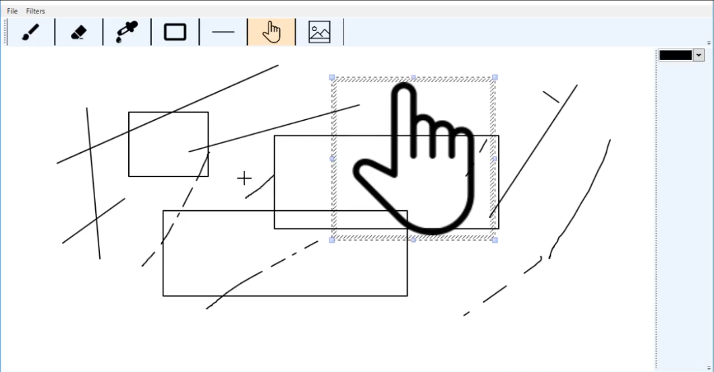
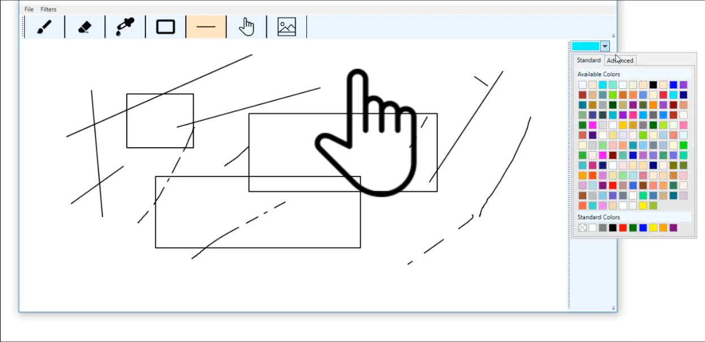
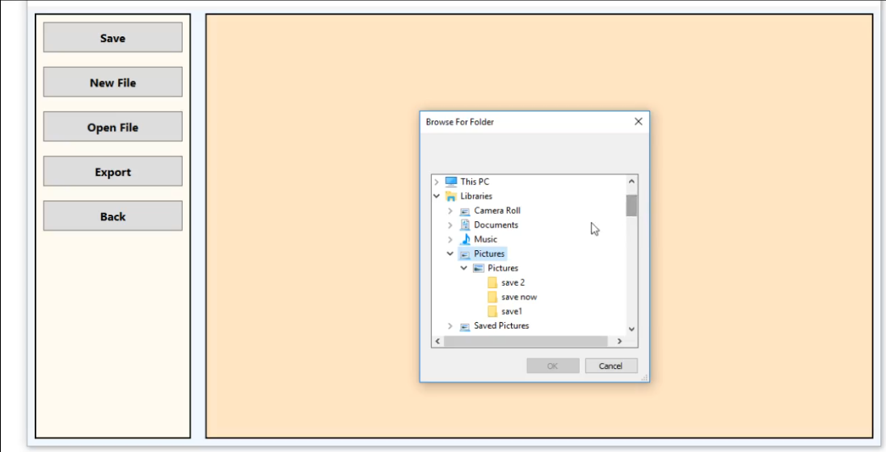
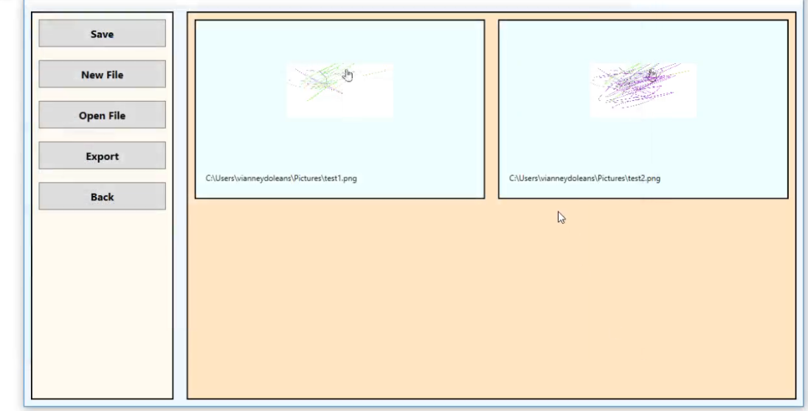

# My42Paint

My42Paint is a paint software, for realizing small creation.

## Project
This project is a student project realized for ICT software module, in Chung Ang University, South Korea, Seoul, June 2019.

## Screenshots
  

## Features

- Tools :
  - Brush
  - Eraser
  - Color picker
  - Rectangle
  - Line
  - Select
  - Image
  - Color palette
- Filters :
  - Black and white
  - GrayScale
  - Sepia
  - Invert
- Others :
  - Options menu
  - Gallery
- Management :
  - Save
  - New File
  - Open File
  - Export
  
##  Platform
- [x] Windows

## Technologies used

- Language : [C#](https://docs.microsoft.com/en-us/dotnet/csharp/)
- GUI : [WPF](https://docs.microsoft.com/en-us/dotnet/framework/wpf/getting-started/introduction-to-wpf-in-vs)
- Framework : [.Net 4.7.2](https://docs.microsoft.com/en-us/dotnet/standard/)

## Contributors
[@Sugihiru](https://github.com/Sugihiru)  
[@VianneyDoleans](https://github.com/VianneyDoleans)  
[@Hardkaise](https://github.com/Hardkaise)  
